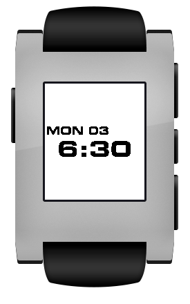

# Odyssey Watchface

This is a simple [Pebble](http://getpebble.com) watchface, inspired by 1960's science fiction films.

*The 9000 series has a perfect operational record.*

## Font

The source tree includes the free [Days](http://www.fontsquirrel.com/fonts/Days) font, which looks like this:

To get the authentic 1960's futuristic look, you can use [Eurostile Bold Extended](http://en.wikipedia.org/wiki/Eurostile)
or [Microgramma](http://en.wikipedia.org/wiki/Microgramma_(typeface):

Note that Eurostile and Microgramma are commercial fonts, not available for free distribution.

To use one of these fonts to build the watchface, do the following:

0. Obtain the font file.
0. Copy the font file to the `resources/fonts` directory.
0. In `appinfo.json`, change the instances of "Days.otf" to the name of your font file.

## License

Copyright (c) 2014 Kristopher Johnson

Permission is hereby granted, free of charge, to any person obtaining
a copy of this software and associated documentation files (the
"Software"), to deal in the Software without restriction, including
without limitation the rights to use, copy, modify, merge, publish,
distribute, sublicense, and/or sell copies of the Software, and to
permit persons to whom the Software is furnished to do so, subject to
the following conditions:

The above copyright notice and this permission notice shall be
included in all copies or substantial portions of the Software.

THE SOFTWARE IS PROVIDED "AS IS", WITHOUT WARRANTY OF ANY KIND,
EXPRESS OR IMPLIED, INCLUDING BUT NOT LIMITED TO THE WARRANTIES OF
MERCHANTABILITY, FITNESS FOR A PARTICULAR PURPOSE AND
NONINFRINGEMENT. IN NO EVENT SHALL THE AUTHORS OR COPYRIGHT HOLDERS BE
LIABLE FOR ANY CLAIM, DAMAGES OR OTHER LIABILITY, WHETHER IN AN ACTION
OF CONTRACT, TORT OR OTHERWISE, ARISING FROM, OUT OF OR IN CONNECTION
WITH THE SOFTWARE OR THE USE OR OTHER DEALINGS IN THE SOFTWARE.

The Days font is used under the terms of the Creative Commons Attribution License v3.00. See <http://www.fontsquirrel.com/license/Days>.
